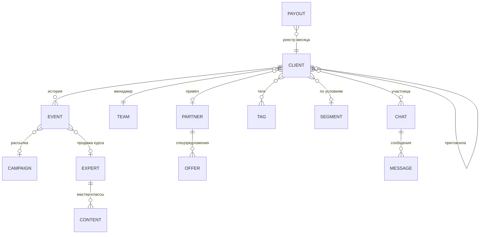

# Eva CRM — работа с клиентами

**Техническое задание, версия 2.** Исходное ТЗ дополнено данными по Eva Space из всех материалов проекта: приложение V2, штаб, положение об амбассадорах, юридическая карта, план съёмок, предложение экспертам. Рядом лежит рабочий прототип: `crm/` в репозитории, артефакт Claude [«Eva CRM — работа с клиентами»](https://claude.ai/artifact/HjC5qXEcVj5R42yw2Q4cYZ). Всё описанное ниже в нём уже можно открыть и попробовать на демо-данных.

---

## 0. Коротко

**Что это.** Единая база клиенток, экспертов и партнёров Eva Space. В ней видны все касания, звонки, переписка и оплаты, клиентки ведутся по воронкам, работают рассылки и реферальная программа. Отчёты строятся из той же базы.

**Кто работает.** Руководитель, старший менеджер, менеджеры по продажам, куратор экспертов и партнёров, наблюдатель (инвестор). Роли описаны в §2.

**Главный принцип.** Одна клиентка — одна карточка со всей историей. Отчёты не хранятся отдельно, а считаются из карточек, поэтому цифры в отчётах и в карточках всегда совпадают.

**Стиль.** Интерфейс сделан так же, как штаб Eva Club: тёмная панель «Ночь», шрифт Inter, фиалковые ссылки, золото и роза только как акценты. Показатели, вкладки, доски и окна устроены одинаково.

---

## 1. Цели и показатели

| Показатель | Цель | Откуда цифра |
| --- | --- | --- |
| Ответ на заявку | не дольше 15 минут в рабочее время | норма CRM, отчёт «Менеджеры» |
| Первые оплаты за IV квартал 2026 | минимум 100, цель 500, прорыв 1 000 | стратегия штаба |
| Регистрация → оплата | 5% | модель штаба |
| Продление подписки | 50% в следующем месяце | модель штаба |
| Эксперты за квартал | 50 и больше, 150+ мастер-классов | стратегия штаба |
| Доля оплат через рефералов | около 20% | финмодель, источники трафика |
| Пушей на клиентку | не больше 2 в неделю | правило приложения |
| Касаний на клиентку | не больше 5 в неделю по всем каналам | новое правило CRM |

---

## 2. Роли и доступ

| Роль | Видит | Может |
| --- | --- | --- |
| **Руководитель** | всё | настройки, команда и роли, ставки, выплаты, очистка базы |
| **Старший менеджер** | всех клиенток, деньги, отчёты | распределять клиенток, править воронки и сегменты, запускать рассылки, выгружать |
| **Менеджер** | своих клиенток и свободные заявки | переписка, звонки, задачи, счета, теги, этапы |
| **Куратор** | всех клиенток, экспертов, партнёров, рефералов | вести экспертов и партнёров, проводить реферальные выплаты |
| **Наблюдатель** | дашборд, клиентки, отчёты | только смотреть |

- Вход в прототип — через аккаунт Claude, без паролей. Первый вход автоматически добавляет человека в команду с ролью «Менеджер», роль меняет руководитель.
- Можно открыть CRM глазами любого сотрудника: кнопка «Как видит» в «Настройках → Команда».
- В производственной версии нужен вход сотрудников через SSO (Яндекс ID или корпоративная почта) и права на уровне сервера (§15).

---

## 3. База данных

### 3.1. Сущности

### 3.2. Таблица клиенток (clients)

Отмеченные «считается» поля руками не вводятся: они вычисляются из истории.

| Группа | Поля |
| --- | --- |
| **Контакты** | имя и фамилия, телефон, почта, Telegram, WhatsApp (если номер другой), город, дата рождения, сфера или ниша (салон красоты, пилатес, своё дело, декрет…), организация (для заявок от студий и салонов) |
| **Воронка** | воронка, этап, причина отказа, сегмент (считается, или выбран вручную), теги, менеджер, источник, кампания (utm), партнёр, пригласившая, дата появления; следующий шаг, последнее касание и число касаний — считаются |
| **Анкета Eva Space** | что важнее всего (до 3 из 6), опыт практик, время в день, отношения, этап жизни, интересы (из 12). Как в регистрации приложения V2 |
| **Подписка и деньги** | подписка (пробная, активна, заканчивается, истекла — считается), оплачено до (считается), пробный доступ до, LTV (считается), число оплат (считается), баланс Евы, бонусы |
| **Согласия** | обработка данных (дата), данные о здоровье (дата), рекламные рассылки (дата), разрешённые каналы |
| **Приложение** | последний вход, звёзды за неделю (из 21), практик пройдено, баллы, уровень (считается) |
| **Рефералы** | промокод-приглашение, программа (подруга, амбассадор, ключевой), как получать (на карту или на баланс), налоговый статус; пригласила подруг и заработала — считаются |
| **Служебные** | id записи, id в приложении, признак демо-записи |

### 3.3. История (события)

Каждое касание — отдельное событие в истории карточки:

| Вид | Что хранится |
| --- | --- |
| `msg` — сообщение | канал (TG, WA, MAX, почта, SMS), направление, текст, статус (отправлено, в очереди, сохранено без отправки), автор |
| `call` — звонок | направление, итог (поговорили, не ответила, занято, перезвонить, неверный номер), длительность, ссылка на запись, итог разговора, расшифровка |
| `camp` — рассылка | id рассылки, канал, статус (доставлено, открыто, переход, ответ, отписка, не доставлено) |
| `pay` — оплата | тип (подписка месяц/год, курс, консультация, мероприятие, клуб, маркет, пополнение, возврат), сумма, способ (карта, СБП, баланс, счёт юрлицу), статус (оплачено, ждёт, не прошла), товар, эксперт, списано бонусами |
| `task` — задача | что сделать, срок, исполнитель, выполнено |
| `note` — заметка | текст |
| `stage` — смена этапа | откуда, куда, воронка, автоматически или вручную, причина |
| `meet` — встреча | созвон, эфир, офлайн |
| `sys` — системное | регистрация, анкета, загрузка из файла, начисление на баланс |

Сообщения клиентки в групповых чатах тоже попадают в её ленту: они берутся из чата и не дублируются в базе.

### 3.4. Остальные таблицы

- **experts** — имя, направление, контакты, соцсети, аудитория, стаж, форматы, подход, доля эксперта, этап, куратор, созвон, съёмка, контент (название, вид, статус, дата), история.
- **partners** — название, категория, город, адрес, контактное лицо и должность, контакты, сайт, формат сотрудничества, ставка, промокод, условия, договор (номер, дата, срок), спецпредложения, этап, история.
- **chats** — групповые чаты: название, вид (конференция, клуб), канал, участницы, сообщения (автор — клиентка или команда).
- **campaigns** — рассылки: канал, текст, аудитория (сегмент или условия, либо выбранные вручную), статус, дата, сколько отправлено и сколько исключено.
- **payouts** — реестр выплат месяца: кому, сколько, как, статус, дата.
- **team** — сотрудники: имя, роль, должность, id входа.
- **cfg** — настройки: воронки и этапы, сегменты, теги, шаблоны, цепочки, сохранённые виды таблицы, интеграции, ставки.

### 3.5. Производственная схема

Прототип хранит историю внутри карточки. Этого хватает примерно на 4 500 клиенток. Для рабочей базы нужна PostgreSQL на сервере в России, схема та же, но таблицы разнесены:

`clients`, `client_events` (партиции по месяцам, индекс `client_id, t`), `payments`, `consents` (версия и хеш текста, IP, устройство, дата отзыва), `tags` + `client_tags`, `segments`, `funnels` + `stages`, `experts` + `expert_content`, `partners` + `partner_offers`, `chats` + `chat_members` + `chat_messages`, `campaigns` + `campaign_recipients`, `referral_accruals`, `payouts`, `users`, `audit_log`. Вычисляемые поля (LTV, подписка, последнее касание, сегмент) хранятся материализованными и пересчитываются по событиям. Тогда отчёты по десяткам тысяч клиенток работают быстро.

---

## 4. Карточка клиентки

**Шапка:** имя, этап, подписка, сегмент, уровень, источник и дата появления, теги (добавить или снять в один клик). Кнопки: «Написать», «Звонок», «Счёт», «Задача», «Изменить».

**Этапы стрелками:** этапы видны все сразу, у текущего — сколько дней на нём. Перевести на другой этап — клик. Для отказа нужно выбрать причину.

**Композер** (одно поле на всё):
- **Сообщение.** Канал с контактом (TG, WA, MAX, почта, SMS) или групповой чат, где клиентка участница. Шаблон с подстановкой имени, промокода и ссылки. Кнопки «Открыть в Telegram / WhatsApp» работают даже без интеграций.
- **Звонок.** Направление, итог, длительность, ссылка на запись, итог разговора, галочка «Перезвонить» ставит задачу. Если «не ответила» — задача ставится сама.
- **Заметка, задача (срок, исполнитель), встреча.**
- **Оплата или счёт.** Тип, сумма, способ, дата, товар, эксперт, списанные бонусы.

**Вкладки ленты:** всё; переписка (включая групповые чаты); звонки с плеером записи; оплаты; задачи; рассылки; рефералы (кого пригласила, что начислено, промокод).

**Боковая панель:**
- Работа: менеджер, следующий шаг, последнее касание, число касаний, сегмент.
- Контакты с кнопкой «копировать».
- Подписка и деньги: статус, оплачено до, LTV, ожидающие счета, баланс, бонусы.
- Анкета Eva Space: ответ «беременность» скрыт, если нет согласия на данные о здоровье.
- Согласия с датами.
- Активность в приложении.
- Откуда пришла: источник, кампания, пригласившая, партнёр, промокод.
- Групповые чаты.
- Предложения партнёров в её городе.

---

## 5. Коммуникации

### 5.1. Каналы
Telegram, WhatsApp, MAX, почта, SMS, пуш, звонок, групповой чат, приложение. **Telegram** — основной канал. **WhatsApp** в России работает с ограничениями: звонки ограничены с августа 2025 года, дальнейшие блокировки возможны. Поэтому важные сообщения дублируются в Telegram, MAX или SMS, а вся переписка хранится в CRM, а не только в мессенджере.

### 5.2. Переписка из CRM
- Раздел «Сообщения»: все диалоги по всем каналам в одном окне. Фильтры: «Ждут ответа», «Непрочитанные», по каналу, «Групповые чаты», «Заявки из приложения».
- Входящее сообщение попадает в карточку. Если на него ещё не ответили, карточка помечается «ждёт ответа» и появляется на дашборде в «Требует внимания».
- Ответ уходит через сервер интеграций: Telegram-бот или личные аккаунты через Wazzup24 или Radist.Online, WhatsApp через Wazzup24 или Green API. Пока канал не подключён, ответ сохраняется в истории со статусом «не отправлено», и видно, что он не ушёл.
- Если сотрудник уходит, переписка остаётся у компании.

### 5.3. Групповые чаты
- У чата есть участницы — ссылки на карточки клиенток.
- **Сообщение, адресованное в «Групповой чат конференции», показывается в групповом чате у всех участниц как часть коллективного чата.** Отправить его можно из раздела «Сообщения» или из карточки участницы (канал «В групповой чат…»). Сообщение попадает в общую ленту чата, а если отправлено из карточки, в нём остаётся пометка, в связи с какой участницей.
- Сообщения участниц видны в ленте их карточек с пометкой чата.
- В демо: «STARTUP UNICONF Бали 2.0 · групповой чат конференции» (15 декабря, Parq Ubud) и «Круг „Своё дело“».

### 5.4. Звонки
Звонок из карточки в один клик. Входящий звонок открывает карточку. Запись и длительность попадают в ленту. Следующий шаг — расшифровка (Yandex SpeechKit) и короткий итог от ИИ. Клиентку нужно предупреждать о записи разговора.

### 5.5. Рассылки и пуши
- Аудитория: сегмент, условия по любым полям или клиентки, выбранные в таблице.
- **До отправки видно, сколько получат и кто исключён:** нет согласия на рассылки, отписалась, нет контакта в канале, уже получила 2 пуша за неделю.
- Предпросмотр на первой получательнице с подставленным именем.
- Статистика рассылки: получили, доставлено, открыли, перешли, ответили, отписались, **оплатили в течение 7 дней** и на какую сумму.
- **Цепочки прогрева:** «Прогрев 1», «Прогрев 2», «Eva Events» (6 касаний после записи на мероприятие) и «Продление подписки». Каждая цепочка — это шаги «день, канал, текст», её можно включить или выключить.
- **Частота:** не больше 2 пушей и 5 касаний в неделю на клиентку. Тихие часы — с 21:00 до 9:00. Две тихие недели подряд — один бережный вопрос. Не пишем «ты забросила».

---

## 6. Воронки

Каждый этап имеет **критерий входа**. На доске он показан подсказкой «?» у названия колонки. Во всех воронках есть этап «Отказ», причина отказа обязательна: дорого, нет времени, не целевая, выбрала другое, не выходит на связь, отложила, другое. Этапы, их названия, критерии и порядок меняются в настройках. Там же создаются новые воронки для клиенток, например «Корпоративные клиенты».

### 6.1. Продажи (клиентки)

| № | Этап | Критерий входа |
| --- | --- | --- |
| 1 | Прогрев 1 | Контакт появился: подписка на канал или бота, лид-магнит, регистрация на эфир. Идёт серия прогрева № 1 |
| 2 | Прогрев 2 | Проявила интерес: открыла письма, пришла на эфир, ответила боту. Серия № 2 — отзывы, предложение |
| 3 | База загружена | Контакт в базе целиком: телефон или мессенджер, согласия, назначен менеджер |
| 4 | Заявка получена | Сама оставила заявку: форма, сообщение, звонок, заявка от партнёра. Ответить за 15 минут |
| 5 | Квалификация пройдена | Был разговор: понятны цель, сегмент и бюджет |
| 6 | Счёт выставлен | Отправлена ссылка на оплату или счёт. Нет оплаты 3 дня — напоминание и звонок |
| 7 | Оплата получена ✓ | Первая оплата прошла |

**Вход с любого этапа.** Купленная или загруженная база стартует с «База загружена», заявка с сайта — с «Заявка получена». Так снимается противоречие исходного порядка, в котором прогрев стоял до загрузки базы.

### 6.2. Эксперты
Список экспертов загружен → созвон назначен → созвон проведён → согласовано → съёмки проведены → контент загружен → оплаты пошли ✓.

### 6.3. Партнёры (новое)
База загружена → первый контакт → встреча проведена → условия согласованы → договор подписан → партнёр активен ✓.

### 6.4. Рефералы
Эта воронка считается сама из данных: ссылка выдана → подруга пришла → подруга оплатила → начислено → выплачено или на балансе.

### 6.5. Разбивка по сегментам
Над доской — сегменты с числом карточек: «Салоны красоты 13», «Пилатес, йога, фитнес 21»… Клик по сегменту фильтрует доску. Отдельный вид «Сегменты × этапы» — матрица с конверсией от заявки до оплаты по каждому сегменту.

### 6.6. Автоматика

| Событие | Действие |
| --- | --- |
| Выставлен счёт | этап «Счёт выставлен», если клиентка была раньше по воронке |
| Пришла оплата | этап «Оплата получена», запись в истории «автоматически: пришла оплата» |
| Звонок «не ответила» или «перезвонить» | задача «Перезвонить» на завтра |
| Входящее без ответа | метка «ждёт ответа», блок на дашборде |
| Счёт не оплачен 3 дня | блок «Требует внимания» (в производстве — цепочка напоминаний) |
| Подписка заканчивается через 7 дней | статус «Заканчивается», цепочка «Продление» |
| Нет касаний 7 дней на активных этапах | блок «Без касания» |
| Регистрация в приложении | карточка с анкетой, этап по источнику, пробный доступ на 3 дня |

---

## 7. Сегменты и условия

- Сегмент — это группа, заданная условиями. Условия можно ставить на **любое поле таблицы**: ниша, город, источник, теги, этап, менеджер, анкета, подписка, LTV, согласия, активность, партнёр.
- Операторы: равно, не равно, одно из, содержит, не содержит, не меньше, не больше, заполнено, пусто, «за последние N дней», «давнее N дней». Условия объединяются через «все» или «любое из».
- Порядок проверки задаётся числом. Клиентка попадает в первый подходящий сегмент. В карточке сегмент можно выбрать вручную, это важнее условий.
- У сегмента есть **«условия работы»** — предложение для этой группы. Например, для салонов: корпоративная подписка для мастеров −20%.
- Сегменты по умолчанию: салоны красоты и косметология; пилатес, йога, фитнес; мамы и беременные; своё дело и карьера; VIP с LTV от 15 000 ₽.
- Те же условия работают в фильтре таблицы (можно сохранить как вид для всей команды), в аудитории рассылки и в конструкторе отчётов.

---

## 8. Теги

- У каждого тега есть группа — статус, интерес, поведение, событие, жизнь, импорт — и цвет. Группа помогает не плодить похожие теги.
- Теги ставятся в карточке, массово в таблице и при загрузке базы. Каждая загрузка получает свой тег, например «Импорт 25 сен».
- При удалении тег снимается у всех клиенток. На тегах можно строить сегменты и отчёты.

---

## 9. Реферальная программа

### 9.1. «Приведи подругу» — для всех клиенток
- Процент с покупок подруги по уровню пригласившей: Ученица — 10%, Практикующая — 20%, Наставница — 30%. Платится в течение 12 месяцев, без учёта списанных бонусов.
- Подруге — 300 бонусов на первый заказ. Подруга закрепляется за пригласившей навсегда по ссылке `eva.space/r/код`.

### 9.2. Амбассадоры — по приглашению
- Процент считается только с подписок и от чистого поступления: платёж − эквайринг ≈3% − налог 6%.
- Стандартная ставка — 30%, ключевым — 50% на первый год. Годовая подписка начисляется по 1/12 в месяц.
- Выплачиваем только самозанятым и ИП.
- Если возвратов больше 15%, начисления ставятся на паузу.

### 9.3. Ежемесячный вывод или использование внутри Евы
1. Начисления за месяц копятся до его конца.
2. После конца месяца для каждой пригласившей виден реестр: начислено за месяц и к выплате с учётом переноса.
3. **На баланс Евы** — без минимума, **+10% сверху**. Деньгами на балансе можно оплатить подписку, курсы и маркет.
4. **На карту** — до 10 числа следующего месяца. Минимум — 3 000 ₽ для подруг и 5 000 ₽ для амбассадоров, меньшие суммы переносятся на следующий месяц.
5. Реестр выгружается в CSV для бухгалтерии. Статусы: к выплате, копится, на паузе, выплачено, зачислено. Отметку можно отменить.

### 9.4. Защита
- Только одна ступень: начислений «с приглашённых приглашённых» нет. Иначе есть риск признания пирамидой (ст. 14.62 КоАП).
- Начисления только с фактических оплат, возврат уменьшает начисление.
- Баллы и бонусы — это скидка без денежного номинала, вывести их нельзя.
- Самоприглашение и накрутка отключают начисления.
- Выплата деньгами физлицу без статуса делает компанию налоговым агентом (НДФЛ и взносы). Поэтому таким клиенткам предлагаем баланс, а амбассадорам — только статус НПД или ИП.

---

## 10. Эксперты

- **Заявка эксперта**, как в приложении: чем занимается, стаж (до года … больше 10 лет), что хочет вести (практики и медитации, мастер-классы, курс, личные консультации, встречи офлайн), где посмотреть, пара слов о подходе. Встреча в Zoom с куратором — 30 минут.
- Карточка эксперта:
  - условия: одна ставка на всех, пока экспертов меньше 20 — 70% эксперту, 30% платформе;
  - даты созвона и съёмки;
  - контент со статусами: в плане, снят, монтаж, опубликован;
  - продажи с его контента, заработок, выплаты и остаток к выплате;
  - история.
- Продажа курса или консультации привязывается к эксперту в форме оплаты клиентки, и доля считается сама.
- На странице раздела: цель 50 экспертов и 150 мастер-классов, ближайшие съёмки (за смену — до 20 посланий, 8–10 практик или 2 мастер-класса), созвоны.

---

## 11. Партнёры

- Карточка партнёра:
  - **условия взаимодействия**: формат — комиссия, взаимный промо, бартер, спонсорство, корпоративная подписка, товары в маркете; ставка; текст условий; договор;
  - **спецпредложения**: что даём, промокод, скидка, до какой даты, для кого;
  - **адрес** со ссылкой на Яндекс Карты;
  - **контактное лицо**: имя, должность, телефон, Telegram, почта;
  - приведённые клиентки, их оплаты, вознаграждение, выплаты и история.
- Категории: салон красоты, студия пилатеса, йога-студия, фитнес-клуб, косметология, SPA, здоровое питание, психологический центр, пространство для встреч, бренд для маркета, организатор мероприятий, спонсор, медиа.
- Вкладка «Спецпредложения» — все действующие предложения с кнопкой «копировать промокод». В карточке клиентки видны предложения партнёров её города.

---

## 12. Отчёты

Готовые отчёты:
- **Воронка** за период. Конверсия по этапам в разрезе сегмента, источника, менеджера, города, ниши, партнёра, тега или ответа анкеты. Причины отказов. Время от появления до оплаты.
- **Деньги.** Поступления по месяцам и типам, средний чек, возвраты, оплаты бонусами, активные подписки на конец месяца.
- **Удержание.** Когорты по месяцу первой оплаты: доля оплативших с живой подпиской через 1–6 месяцев.
- **Менеджеры.** Клиентки, новые, звонки, дозвон, минуты разговоров, сообщения, медиана времени ответа, закрытые и просроченные задачи, оплаты и сумма.
- **Каналы и рассылки.** Открытия, переходы, ответы, отписки по каналам. Оплаты после рассылок.
- **Конструктор.** Группировка по любому полю × показатели: клиенток, дошли до заявки, оплатили, конверсия, LTV, средний LTV, активная подписка, касаний в среднем, отказов. Условия по любым полям, выгрузка в CSV. Это и есть «отчёты по необходимости» из исходного ТЗ.

Дашборд за выбранный период:
- новые контакты, первые оплаты, выручка, активные подписки, план квартала, «ждут ответа»;
- воронка, «Требует внимания», задачи;
- деньги по месяцам, источники, менеджеры, лента событий.

---

## 13. Интеграции

| Что | Рекомендуем | Что даёт |
| --- | --- | --- |
| Приложение Eva Space | вебхуки: регистрация, анкета, согласие, оплата, активность раз в сутки | карточка появляется сама, анкета и согласия с датой и версией |
| Telegram | бот (Bot API) и личные аккаунты через Wazzup24 или Radist.Online | переписка и групповые чаты из CRM |
| WhatsApp | Wazzup24 или Green API; Business API через провайдера | переписка, шаблоны |
| MAX | API ботов MAX | резервный канал |
| Телефония | Манго Офис, UIS, Zadarma, Sipuni | звонок в клик, записи, входящие открывают карточку |
| Расшифровка | Yandex SpeechKit + ИИ-итог | текст и краткий итог звонка в ленте |
| Почта | UniSender, Dashamail, SendPulse (SPF и DKIM на домене) | письма и рассылки со статистикой |
| Пуш | Firebase Cloud Messaging, RuStore Push | пуши с лимитом 2 в неделю |
| SMS | SMS.ru, SMSC, SMS Aero | коды и напоминания |
| Оплаты | ЮKassa, CloudPayments, Продамус | оплаты и возвраты в карточке, автопродления, ссылка на оплату |
| Выплаты самозанятым | сервис выплат с чеками НПД | реферальные и партнёрские выплаты без ручных чеков |
| Штаб Eva Club | сводка раз в сутки | «Цифры дня» без ручного ввода |

Ключи доступа хранятся только на сервере интеграций. В CRM их не вводят.

---

## 14. Персональные данные и закон

- **152-ФЗ, ст. 18 ч. 5.** Первичный сбор и хранение данных граждан РФ — в базах на территории России. Производственная CRM размещается в российском облаке (Yandex Cloud, Selectel, VK Cloud). Прототип-артефакт работает на демо-данных, реальную базу клиенток в него не загружаем.
- **Согласие на обработку данных** с 01.09.2025 оформляется отдельным документом. Храним дату, версию и хеш текста, устройство и IP. Каждое согласие отзывается отдельно, после отзыва данные удаляются в течение 30 дней.
- **Данные о здоровье** (цикл, беременность, сон, тревожность) — отдельная галочка. Без неё CRM скрывает эти ответы анкеты. Доступ к ним логируется.
- **Рекламные рассылки — только с согласия** (38-ФЗ «О рекламе», ст. 18). CRM не отправляет рассылку без согласия и показывает, кого исключила. Отписка — в один клик. Личный ответ на сообщение клиентки рекламой не считается.
- **Уведомление Роскомнадзора** об обработке данных. Об утечке сообщаем за 24 часа.
- **Звонки.** Предупреждаем о записи разговора. Записи — это тоже персональные данные, срок хранения нужно ограничить, например 12 месяцами.
- **Реклама в Instagram** запрещена с 01.09.2025. Источник «Instagram» в CRM не ведём.
- **Рефералы** — одна ступень, только с фактических оплат (§9.4).

---

## 15. Архитектура и этапы внедрения

**Этап 0 — сделан.** Рабочий прототип: все разделы и сценарии на демо-данных, общая база команды в артефакте Claude. Здесь проверяем процессы, поля и отчёты до того, как тратить деньги на разработку.

**Этап 1 — рабочая база, 3–4 недели.**
- PostgreSQL и API на сервере в России, вход сотрудников через SSO, роли на сервере, журнал действий.
- Перенос схемы из прототипа, загрузка базы из приложения.
- Вебхуки приложения и оплат, Telegram-бот и WhatsApp через Wazzup24.

**Этап 2 — касания, 3–4 недели.**
- Телефония с записями и расшифровкой, почта и пуши.
- Движок цепочек прогрева, тихие часы и лимиты частоты на сервере.
- Автоматический реестр выплат с сервисом НПД.

**Этап 3 — умная CRM.**
- Итог звонка и переписки от ИИ.
- «Следующий лучший шаг» для менеджера.
- Скоринг заявок по анкете и поведению, прогноз оттока.
- Рейтинг амбассадоров 0–100 (удержание, годовые, объём, возвраты, обязательства) — ставка на следующий год: 80+ → 50%, 60–79 → 40%, ниже → 30%.

**Купить или сделать.** amoCRM или Битрикс24 с Wazzup дают переписку и воронки из коробки. Но специфику Евы — анкету и подписку из приложения, реферальные начисления с балансом, экспертов с долей, групповые чаты конференций, согласия по 152-ФЗ — там придётся собирать доработками и таблицами. **Рекомендация:** своя CRM по этой схеме. Прототип уже покрывает процессы, а интеграции подключаются через Wazzup и платёжный шлюз так же, как в коробочных CRM. Если нужно стартовать продажи до конца этапа 1, временно можно вести переписку в Wazzup и раз в день загружать её в CRM.

---

## 16. Что проверено и улучшено относительно исходного ТЗ

1. **Критерии входа для каждого этапа** и вход в воронку с любого этапа. Порядок «Прогрев → База загружена» больше не противоречит купленной базе.
2. **Отказ с обязательной причиной** в каждой воронке и отчёт по причинам.
3. **Добавлена воронка партнёров.** Воронка рефералов считается сама, её не нужно двигать руками.
4. **Сегменты — это условия по любым полям**, у них есть порядок и ручной выбор. Условия переиспользуются в фильтрах, рассылках и отчётах.
5. **LTV, подписка, последнее касание и сегмент считаются из истории**, их нельзя «поправить» руками и разойтись с оплатами.
6. **Автоматика этапов:** счёт и оплата двигают карточку сами. Звонок без ответа ставит задачу.
7. **Согласия — отдельные поля**, рассылка без согласия невозможна, данные о здоровье скрыты без отдельной галочки.
8. **Групповые чаты** с участницами: сообщение в чат конференции видно всем и попадает в историю.
9. **Реферальный вывод раз в месяц** с выбором «на карту» или «на баланс +10%», минимумами, паузой и реестром для бухгалтерии. Только одна ступень.
10. **Лимиты частоты касаний** и тихие часы, как в правилах приложения.
11. **Уровень «Эксперт» переименован в «Практикующая»**, чтобы не путать клиентку-наставницу с экспертом платформы. Нужно сделать то же в приложении.
12. **Хранение реальных данных в России** и отдельная производственная база. Прототип — для процессов, не для реальных данных.
13. **WhatsApp — не единственный канал:** резерв в Telegram, MAX и SMS.
14. **Импорт базы с защитой от дублей** по телефону и почте: дубль дополняется, а не создаётся заново. Согласия из файла не берём.

---

## 17. Решения, которые нужны от команды

1. **Ставки «Приведи подругу».** В первой версии приложения было 10/15%, во второй — 10/20/30%. В CRM взяты 10/20/30%, ставки меняются в «Рефералах → Условия».
2. **Бонус +10% за баланс** — новое предложение. Нужно подтвердить или обнулить.
3. **Минимум вывода:** 3 000 ₽ для подруг и 5 000 ₽ для амбассадоров. Оставляем разными?
4. **Счета юрлицам** (салоны, студии, корпоративная подписка). Нужны ли поля ИНН, КПП и закрывающие документы в производственной версии?
5. **Где живёт групповой чат конференции:** в Telegram-группе (CRM пишет через бота) или внутри приложения Евы?
6. **Кто подключает Wazzup и телефонию** и на какие номера: общий номер отдела или личные номера менеджеров.
7. **Срок хранения записей звонков и переписки** после отказа клиентки.
